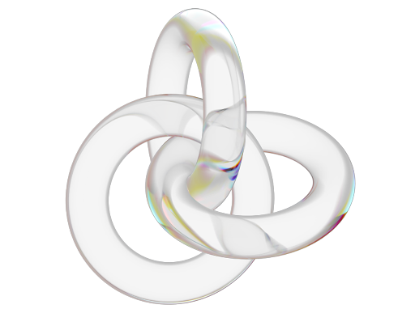

<!--------------------------------------------------------------------------------------->

<!-- Header -->
<div align="center">
  
  <h1>Known.nvim</h1>
</div>

<!-- Badges -->
<div align="center">

[![Licence][license-badge]][license] [![Issues][issues-badge]][issues] [![Code Size][code-size-badge]][code_size] [![Neovim Minimum Version][neovim-badge]][neovim]

</div>

<!-- Outro -->
<div align="center">
  <p>A config that make you feel like you've <i>known</i> Neovim for ever.</p>
  <a href="#what">W's</a> • <a href="#principles">Principles</a> • <a href="#installation">Installation</a> • <a href="#features">Features</a> • <a href="#contributing">Contributing</a>
</div>

<!--------------------------------------------------------------------------------------->

<br/>


<!--------------------------------------------------------------------------------------->

<h2 id="what">😶‍🌫️ What?</h2>

A heavily opinionated, performant, and functional Neovim config. Without forgetting the usability, simplicity, and visual appeal. Every line was carefully written, and every plugin has a reason to be there.

> Crafting a config that is not only **fast**, but also **easy** to use, **and beautiful** to look at.

<h2>🤔 Why?</h2>

When I was looking for a better alternative to modern IDEs, which are _heavy, slow, and bloated with tools I'd never use_. I found out about **Neovim**, some months later and I tried every config out there, and I was not satisfied. I wanted a config that had a motivation behind every **plugin**, and every **keybinding**. I wanted a config that was _fast, and easy to use_. I wanted a config that was _beautiful to look at_, and that made me feel like switching from any other editor.

<h2>⛓ Principles:</h2>

This configuration was built following these 2 sets of principles:

<details>
  <summary>🖼 UI (Neovim)</summary>

<br/>

- Less is more.
  - The UI elements should have a purpose, the focus is on the code, and the UI should add information and relevant information.
- Less information does not mean ugly, raw, or boring.
- Icons are not just pretty, they are also useful.
  - Predictable icons are better than text.
  - Icons are faster to read.
  - Icons are easier to remember.
- The UI should be consistent.
  - The UI should not change drastically from one plugin to another.
  - CLS (Cumulative Layout Shift) should be avoided.
- The UI should be lazy and never block the user.

</details>

<details>
  <summary>📄 The Config. (Code)</summary>

<br/>

- Never do or accept anything without knowing why.
  - Plugins should be installed with a reason. And if needed, they should come with an explanation.
  - Keybindings are only accepted if they are **useful**, not just for the sake of having them.
    - _Sporadically, once, if a ever need..._ Are **not** good excuses.
- Errors should not pass silently, they should be annoying, loud, and clear.
  - If it's bothering you, fix it.
- Easy use is directly proportional to performance. A Slow environment is a bad environment.
  - Waiting removes the focus from the task at hand.
  - Locking changes your focus to check if everything is alright.

</details>

<h2 id="installation">⬇️ Installation</h2>

The installation is very simple, just run the following command:

```bash
git clone --depth 1 https://github.com/rafaelrcamargo/know.nvim.git ~/.config/nvim
```

> **Warning**
> If you already have a `~/.config/nvim` folder, you probably want to back up it first.

<h2 id="features">💡 Features</h2>

The optimization and set of rules that this config follows make it very efficient, and easy to use and remember. The following list is a summary of the features that this config has:

<details>
  <summary>🔮 Neovim</summary>

- Packer:
  - A package manager to ease the lazy loading of plugins.
- Telescope:
  - A fuzzy finder to find files, buffers, commands, etc.
- Neoclip:
  - A clipboard manager to copy and paste from the Neovim buffer.
- Feline:
  - A status line to show information about the current buffer.
- Bufferline:
  - A tabline to show the open buffers.
- Nvim-tree:
  - A file explorer to navigate through the files.
- Dashboard:
  - A fancy start screen to welcome you.
- Copilot:
  - A AI pair programmer to help you write code.
- Inyoface:
  - A better way to find and read comments.
- TODO-comments:
  - A highlighter for TODO, FIXME, BUG, etc.
- Twilight:
  - A plugin to focus only on the code you are writing.
- Gitsigns:
  - A plugin to show git changes in the gutter.
- Mason:
  - A helper for the LSP installation process.
- Neodim:
  - Don't ever again forget unused code laying around.
- Null-ls:
  - A LSP+ experience with a lot of extra features.
- Coq:
  - A Fast as F#CK autocomplete engine.

</details>

> **Note**
> Ok, that's a lot of features I got, but these are only the most relevant ones. There are lots of configurations meant only to make your life easier, and to make you feel at home.

<h3>🎨 Colorschemes</h3>

The main color scheme used in this config is [material-gruvbox](https://github.com/sainnhe/gruvbox-material), but with this **beautiful** theme comes a huge problem, and a thing avoided by any sane person: **IS VIMSCRIPT**. So, to avoid the performance hit, this config uses [catppuccin](https://github.com/catppuccin/nvim) a modern and one of, if not the most advanced color scheme for Neovim. It is written in Lua and compiled as you need, so it's very fast. And with it we can use the colors and create our material-gruvbox color scheme, jumping from `~12.01ms` to a load time of `~0.03ms`.

> 🍨 Soothing pastel theme for (Neo)vim

<!-- TODO: Catppuccin demo -->

But this is not all, also nebulous is configured, just not active for now.

> nebulous.nvim: Minimalist Collection of Color schemes for Neovim Written in Lua

<!-- TODO: Nebulous demo -->

<h2>🤝 Contributing</h2>

If you want to contribute to this project, you can do it in many ways:

- **Report bugs**:
  - If you find a bug, please report it in the [issues](issues)
- **Request features**:
  - If you have a feature request, please report it in the [discussions](discussions)

> But the biggest one, discuss, discuss, discuss. If you have a problem or a doubt, or just want to talk about something, please do it, I'm always open to talking about anything.

<h2>📝 TODO</h2>

- [ ] ...
- [x] ...
- [ ] ...

<h2>📜 Changelog</h2>

See the [CHANGELOG.md](CHANGELOG.md) file for more information.

<h2>🗂 Inspirations</h2>

- [ChristianChiarulli](https://github.com/LunarVim) for LunarVim, a awesome Neovim configuation, full of features and very well documented.
  - Definitely the most advanced project for a Neovim configuration out there.
- [NvChad](https://github.com/NvChad/NvChad) for a _fast_, well documented and easy to use Neovim configuration.
  - The most starred Neovim configuration on GitHub.

And finally, but not least, [quick.nvim](https://github.com/albingroen/quick.nvim) a smaller, faster and simpler Neovim configuration. The one that finally made me want to start my own configuration from scratch, and lose the fear of doing so.

<h2>🔓 License</h2>

This project is licensed under the [Apache License 2.0][license].

<!--------------------------------------------------------------------------------------->

<!-- Badges -->

[license-badge]: https://img.shields.io/github/license/rafaelrcamargo/dotfiles?style=flat-square&color=e78a4e&label=License
[issues-badge]: https://img.shields.io/github/issues/rafaelrcamargo/dotfiles?style=flat-square&color=d8a657&label=Issues
[code-size-badge]: https://img.shields.io/github/languages/code-size/rafaelrcamargo/dotfiles?style=flat-square&color=a9b665&label=Code%20Size
[neovim-badge]: https://img.shields.io/badge/Neovim-0.8.0-blueviolet.svg?style=flat-square&color=89b482

<!-- Links -->

[license]: https://github.com/rafaelrcamargo/dotfiles/blob/main/LICENSE
[issues]: https://github.com/rafaelrcamargo/dotfiles/issues
[discussions]: https://github.com/rafaelrcamargo/dotfiles/discussions
[code_size]: https://github.com/rafaelrcamargo/dotfiles/tree/main
[neovim]: https://github.com/neovim/neovim

<!--------------------------------------------------------------------------------------->
